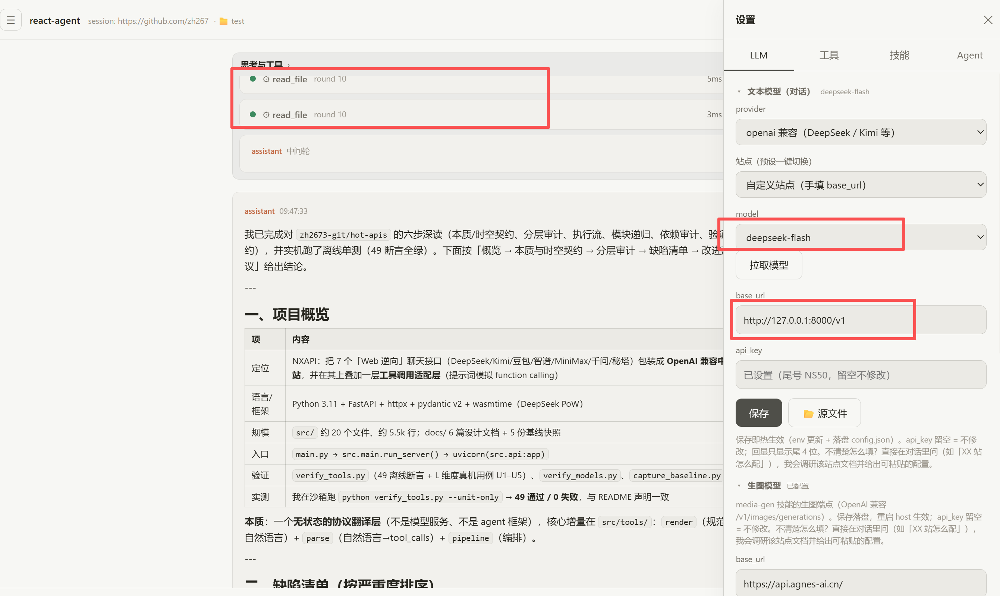
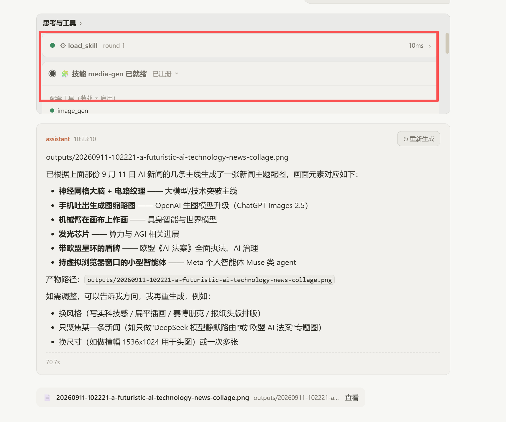

# hot-apis · Multi-Model API Relay

A unified **OpenAI-compatible** API service: one endpoint, one protocol, multiple Chinese
mainstream LLM platforms behind it. Implemented via reverse-engineered web sessions,
**with tool calling fully working (agents can plug right in)**.

English | [中文](README.md)

> **Scope of use**: This project is for **personal learning and technical research ONLY**.
> Commercial use or serving third parties is prohibited. Reverse-engineered endpoints are
> unofficial and may break at any time; for production use, please use the platforms'
> **official APIs** (recommended below).

## Features

- **OpenAI compatible**: `/v1/chat/completions` + `/v1/models` — just point your openai SDK
  at a new `base_url`
- **Tool calling ✅**: standard `tools` / `tool_calls` / `role:"tool"`; works out of the box
  with Cline, Roo Code, Continue and other agents (upstream has no native function calling;
  a built-in protocol translation layer simulates it)
- **Streaming**: SSE incremental output
- **Reasoning chains**: R1 / GLM thinking content is included in responses
- **Auto token refresh**: Kimi access_token (~15 min TTL) is refreshed automatically

## Supported Platforms

| Platform | Status | Representative models |
|------|------|----------|
| DeepSeek | ✅ | deepseek-flash, deepseek-reasoner |
| Kimi | ✅ | kimi-k3, kimi-k2.7-code |
| Doubao | ✅ | doubao-seed-2.1-pro |
| Zhipu (ChatGLM) | ⚠️ intermittent empty replies | glm-5.3 |
| MiniMax | ✅ | MiniMax-M3 |
| Qwen | ❌ upstream risk control | qwen3.8-max |
| Metaso | ❌ upstream rate limit | metaso-research |

Full model list: `GET /v1/models` after startup, or the `models` property in
`src/providers/*.py`.

## Quick Start

```bash
pip install -r requirements.txt
cp .env.example .env      # fill in at least one platform token (see table below)
python main.py            # http://localhost:8000 by default (see config.yaml)
```

```python
from openai import OpenAI

client = OpenAI(base_url="http://localhost:8000/v1", api_key="not-needed")
stream = client.chat.completions.create(
    model="deepseek-flash",
    messages=[{"role": "user", "content": "Hello"}],
    stream=True,
)
for chunk in stream:
    print(chunk.choices[0].delta.content or "", end="")
```

## Tool Calling

Pass `tools` in the standard OpenAI shape and read standard `tool_calls` back:

```python
resp = client.chat.completions.create(
    model="deepseek-flash",
    messages=[{"role": "user", "content": "What's the weather in Suzhou tomorrow?"}],
    tools=[{
        "type": "function",
        "function": {
            "name": "web_search",
            "description": "Web search",
            "parameters": {"type": "object",
                           "properties": {"query": {"type": "string"}},
                           "required": ["query"]},
        },
    }],
)
print(resp.choices[0].finish_reason)   # tool_calls
print(resp.choices[0].message.tool_calls[0].function)
```

Feed tool results back as `{"role": "tool", "tool_call_id": "...", "content": "..."}`
to continue the loop.

| Platform | Tool calling | Notes |
|---|---|---|
| DeepSeek / Kimi / Doubao | ✅ 100% in live tests | prefer `stream: true` for agents |
| Zhipu | ⚠️ | provider intermittently returns empty (upstream issue) |
| Qwen / Metaso | ❌ | upstream risk control / rate limit |

### Live Demo

The screenshots below come from my self-developed agent project,
**[react-agent](https://github.com/zh2673-git/react-agent)** (Rust kernel, maximum
performance). Connected to this service, it reliably performs tool calling and skill
loading — good enough for daily use.

**Connection settings**: provider "OpenAI compatible", model `deepseek-flash`, endpoint
pointing at this service `http://127.0.0.1:8000/v1` —



**In action**: `load_skill` loads the media-gen skill (10 ms), then `image_gen` is
called successfully to generate an image —



> Other agents (Cline / Roo Code / Continue etc.) are **untested; results are not
> guaranteed**. This service exposes the standard OpenAI `tools` protocol, so they should
> work in theory — verification and feedback are welcome.

### Rate limiting & account safety (important)

High-frequency calls on reverse-engineered channels trigger upstream risk control: at
best responses come back empty, at worst the account gets **temporarily muted**
(observed 2026-09-11: "account muted until 11:02 the next day"). The relay therefore
enforces a per-platform minimum interval with automatic queueing:

- Default **3000 ms** per platform; tune via `rate_limit.min_interval_ms` in `config.yaml`
  (per-platform `overrides`) or the `RATE_LIMIT_MS` env var; set `0` to disable (at your
  own risk)
- **While an account is muted, stop calling that platform** until the ban lifts
- Multi-turn agent tool loops are covered by the same limiter — no extra config needed
- For high-throughput scenarios, use the official APIs (recommended above)

## Getting Tokens

Log in to each platform → open DevTools (F12) → grab the value per the table → paste into
`.env` (empty entries are simply disabled):

| Env var | Login URL | Where to find it | Format |
|---|---|---|---|
| `DEEPSEEK_TOKEN` | chat.deepseek.com | F12 → Network → request header `authorization`, value after `Bearer ` | Base64 string |
| `KIMI_TOKEN` | www.kimi.com | F12 → Application → Local Storage → `access_token` | JWT (`eyJ...`) |
| `KIMI_REFRESH_TOKEN` | same | same → `refresh_token` (strongly recommended, enables auto refresh) | JWT |
| `METASO_TOKEN` | metaso.cn | F12 → Application → Cookies → join `uid` and `sid` with `-` | `uid-sid` |
| `DOUBAO_TOKEN` | www.doubao.com | F12 → Application → Cookies → `s_v_web_id` or `sessionid` | 32-char hex |
| `QWEN_TOKEN` | www.qianwen.com | F12 → Application → Cookies → copy the **full** cookie string | Cookie string |
| `ZHIPU_TOKEN` | chatglm.cn | F12 → Application → Cookies → `chatglm_refresh_token` | JWT |
| `MINIMAX_TOKEN` | agent.minimaxi.com | F12 → Application → Local Storage → `_token` | JWT |

> Tokens are web-session based. On 401/403, just re-grab them per the table; with Kimi's
> refresh token configured, maintenance is automatic.

## ⭐ Recommended: Solve Token Scarcity with Official APIs

Reverse-engineered channels are inherently fragile: tokens expire, rate limits apply, and
any upstream redesign breaks things. **If your use goes beyond personal experiments, use
the official APIs** — all of them are OpenAI-compatible, so just swap the `base_url`
in the example above; no code changes needed:

| Platform | Official API Base URL | Console / Keys |
|---|---|---|
| DeepSeek | `https://api.deepseek.com` | [platform.deepseek.com](https://platform.deepseek.com) |
| Kimi (Moonshot) | `https://api.moonshot.cn/v1` | [platform.moonshot.cn](https://platform.moonshot.cn) |
| Zhipu GLM | `https://open.bigmodel.cn/api/paas/v4` | [open.bigmodel.cn](https://open.bigmodel.cn) |
| Qwen (Bailian) | `https://dashscope.aliyuncs.com/compatible-mode/v1` | [bailian.console.aliyun.com](https://bailian.console.aliyun.com) |
| Doubao (Volcengine Ark) | `https://ark.cn-beijing.volces.com/api/v3` | [console.volcengine.com/ark](https://console.volcengine.com/ark) |
| MiniMax | `https://api.minimaxi.com/v1` | [platform.minimaxi.com](https://platform.minimaxi.com) |
| Metaso | see official open platform | [metaso.cn](https://metaso.cn) |

Official APIs give you: native function calling, stable throughput, billing/quota
guarantees, and stable model names.

## Known Limitations

- Qwen & Metaso: upstream moved to risk-control gateways / rate limiting; not usable with
  a pure-HTTP architecture (see [docs](docs/))
- Zhipu: intermittent empty replies (upstream issue, unrelated to this project)
- Model lists come from the web UI; some internal codes are not officially documented —
  live testing is the source of truth

## Verification Scripts

```bash
python verify_models.py          # model connectivity (live)
python verify_models.py --all    # all models
python verify_tools.py           # tool-calling unit tests (49 assertions)
python verify_tools.py --llm     # tool-calling live cases
```

## License

MIT License — personal research use only; please respect each platform's terms of service.
